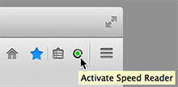

Speed Reader Quick Start
========================

- [Install](http://testacoda.xfos.net:5252/sa/)

- visit  

- click 

### Unity3D API Interface
  
`/` : search class  
`#` : search attribute  
  
`@` : select class  
  
`r` : select random attribute  
`f` : select random function  

- (more in [User Manual](https://github.com/xfosdev/SpeedReader/blob/master/MANUAL.md))  

- - -  
  
###### *[Send Feedback and Comments](https://github.com/xfosdev/SpeedReader/issues)*
