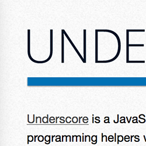

Speed Reader User Manual
======================== 

# <a href="http://docs.unity3d.com/Documentation/ScriptReference/index.html" target="_blank"></img></a> Unity3D API

`/` : search class  
`#` : search attribute  
  
`@` : select class  
  
`r` : select random attribute  
`f` : select random function  

`h` : turn left
`n` : turn right
  
===
  
# <a href="http://www.bloomberg.com/news/economy/" target="_blank"></img></a> Economy News

### Basic
__navigate__:     left `j`, right `l`  
__page__:         down `d`, up `e`  
__zoom__:         larger `h`, smaller `n`  

### Reading
`m` : load the next batch of stories  

`k` : mark the current story as read and advance to next  

`i` : mark the current story as read  
`,` : mark the current story as unread  

`$` : remove all read stories    

### Storage
`s` : save current state  
`r` : restore last saved state   
  
### Misc 
`y` : activate and toggle the on-page interface layer  
`#` : switch to alternate keyboard layout  
  
===

# <a href="http://underscorejs.org/" target="_blank"></img></a> JS API
  
`k` : shuffle all cards  
  
`r` : bring a random card to front  
  
`/` : search among visible cards  
`d` : bring search result to front, one at a time  

`i` : cycle through groups, hide non-group cards  
`,` : show all cards  
  

===
##### [FAQ](https://github.com/xfosdev/SpeedReader/blob/master/FAQ.md)
  
###### *[Send Feedback](https://github.com/xfosdev/SpeedReader/issues)*
